# 🎰 SlotTok

A web-based slot machine game integrated with short-form video content. This prototype combines the excitement of slot machines with algorithmic short-form content feeds.

## Features

- 🎰 Slot machine gameplay with animations and win detection
- 📱 Mobile-first, responsive design
- 🎥 Vertical video feed with smooth scrolling
- 💫 Power-up system with multipliers
- 📊 Real-time statistics tracking
- 🎮 Game state management with win history

## Tech Stack

- React + TypeScript
- Vite
- Tailwind CSS
- Framer Motion
- React Query
- Pexels API for video content

## Project Structure

```
src/
├── components/       # UI Components
│   ├── common/       # Shared components
│   ├── game/         # Game-specific components
│   ├── layout/       # Layout components
│   └── video/        # Video player components
├── hooks/            # Custom hooks
│   ├── game/         # Game-related hooks
│   └── video/        # Video-related hooks
├── utils/            # Utility functions
│   ├── errors/       # Error handling
│   └── game/         # Game logic
├── services/         # API services
├── types/            # TypeScript types
└── globals.css       # Global styles
```

## Getting Started

### Prerequisites

- Node.js (v18 or higher)
- pnpm

### Installation

1. Clone the repository:

```bash
git clone https://github.com/vkuprin/slot-tok
cd slot-tok
```

2. Install dependencies:

```bash
pnpm install
```

3. Create a `.env` file in the root directory:

```env
VITE_PUBLIC_PEXELS_API_KEY=your_pexels_api_key
VITE_API_URL=http://localhost:3001
```

4. Start the development server:

```bash
pnpm dev
```

### Available Scripts

- `pnpm dev` - Start development server
- `pnpm build` - Build for production
- `pnpm preview` - Preview production build
- `pnpm lint` - Run ESLint
- `pnpm typecheck` - Run TypeScript type checking

## Diagrams

```mermaid
flowchart TD
    %% Architecture Diagram
    subgraph Architecture [Architecture Diagram]
        A1["User Browser (Desktop/Mobile)"]
        A2["React Frontend (Vercel, Node.js + TypeScript)"]
        A3["Slot Machine Component"]
        A4["Video Feed Component"]
        A5["Slot & Video Synchronization Logic"]
        A6["Backend API (AWS)"]
        
        A1 --> A2
        A2 --> A3
        A2 --> A4
        A3 --> A5
        A4 --> A5
        A5 --> A6
    end

    %% Services Diagram
    subgraph Services [Services Diagram]
        S1["User"]
        S2["Slot Machine"]
        S3["Video Feed"]
        S4["Backend API"]
        
        S1 --> S2
        S2 --> S2a["Start slot spin animation"]
        S2 --> S3["Trigger advanceToNextVideo()"]
        S3 --> S3a["Advance video index"]
        S3 --> S4["Fetch new videos if needed"]
        S4 --> S3b["Return video data"]
        S3 --> S1b["Display next video"]
        S2 --> S2b["Evaluate spin result and update credits/wins"]
    end

    %% Logic Diagram
    subgraph Logic [Logic Diagram]
        L1["User clicks Spin Button"]
        L2{"Are credits sufficient and not already spinning?"}
        L3["Show error message"]
        L4["Start spin animation (2s delay)"]
        L5["Dispatch USE_CREDITS & INCREMENT_SPINS"]
        L6["Call videoFeed.advanceToNextVideo()"]
        L7["Advance video index and fetch new videos if needed"]
        L8["Generate slot spin result"]
        L9{"Is it a win?"}
        L10["Dispatch ADD_CREDITS, INCREMENT_WINS,<br/>update win history"]
        L11["No additional credit update"]
        L12["Spin complete"]

        L1 --> L2
        L2 -- No --> L3
        L2 -- Yes --> L4
        L4 --> L5
        L5 --> L6
        L6 --> L7
        L7 --> L8
        L8 --> L9
        L9 -- Yes --> L10
        L9 -- No --> L11
        L10 --> L12
        L11 --> L12
    end
```

